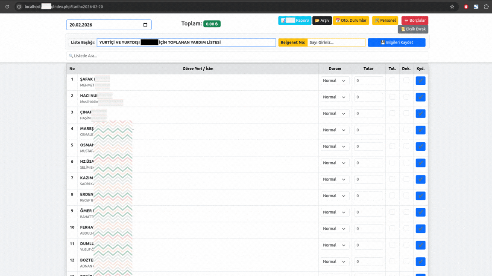

<h1 align="center">🇬🇧 Aid Tracking System</h1>
<h3 align="center">🇹🇷 Yardım Takip Sistemi</h3>

  A professional system for tracking and managing domestic and international aid collections. 
  Yurt içi ve yurt dışı yardım toplama süreçlerinin düzenli ve şeffaf şekilde takibi için geliştirilmiştir.

  

---

## 🚀 About the Project | Proje Hakkında

### 🇬🇧 English
**Aid Tracking System** is designed to manage aid collection processes in a clear, structured, and efficient way.  
It allows users to record donors or locations, enter collected amounts, track statuses, and automatically calculate totals — all from a single interface.

### 🇹🇷 Türkçe
**Yardım Takip Sistemi**, yardım toplama ve takip süreçlerini tek ekrandan yönetmek için geliştirilmiştir.  
Kişi veya görev yeri bazlı kayıtlar, tutar girişleri, durum takibi ve otomatik toplam hesaplama gibi işlemler pratik bir şekilde yapılabilir.

---

## ✨ Key Features | Öne Çıkan Özellikler

### 🇬🇧
- 📅 Date-based aid lists  
- 👤 Donor / Location-based records  
- 💰 Amount entry with automatic total calculation  
- ⚙️ Status tracking  
- 📄 Document / reference number support  
- 🧾 Reporting and archiving infrastructure  
- 🔍 Quick search and filtering  

### 🇹🇷
- 📅 Tarih bazlı yardım listeleri  
- 👤 Kişi / Görev yeri bazlı kayıt  
- 💰 Tutar girişi ve otomatik toplam hesaplama  
- ⚙️ Durum takibi  
- 📄 Belge / kayıt numarası desteği  
- 🧾 Raporlama ve arşivleme altyapısı  
- 🔍 Hızlı arama ve filtreleme  

---

## 🎯 Purpose | Amaç

### 🇬🇧
The main goal is to:
- Prevent record confusion  
- Ensure transparency  
- Reduce manual errors  
- Create a sustainable and reliable aid tracking system  

### 🇹🇷
Bu sistemin amacı:
- Kayıt karmaşasını önlemek  
- Şeffaflığı sağlamak  
- Manuel hataları azaltmak  
- Güvenilir ve sürdürülebilir bir yardım takip altyapısı oluşturmaktır  

---

## 🏛️ Use Cases | Kullanım Alanları

### 🇬🇧
- Mosque and religious institution aid tracking  
- Foundations and charity organizations  
- Local and international humanitarian aid projects  

### 🇹🇷
- Cami ve Kur’an Kursu yardımları  
- Dernek ve vakıf organizasyonları  
- Yerel ve uluslararası insani yardım çalışmaları
- Düzenlenmeye Açıktır.

---

  <i>The full workflow of the system can be seen in the demo GIF above.</i> 
  <i>Sistemin tüm işleyişi yukarıdaki tanıtım GIF’inde yer almaktadır.</i>

